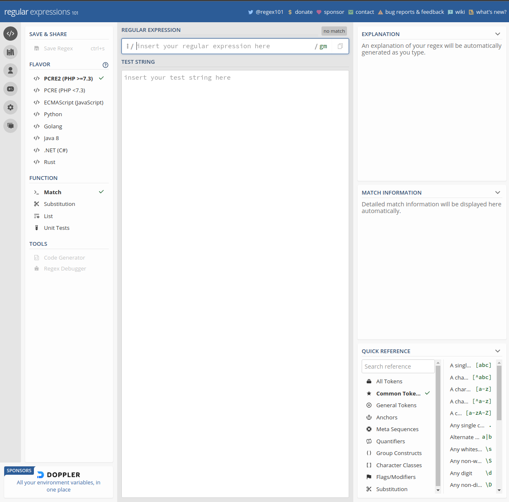

# Работа со скриптами

## Работа с Markdown

Горизонтальные линии разделители состоят из 3 и более "-" и "*".

---

> Это цитаты
>> Это вложенная цитата

***

Список в виде checkbox'ов

- [x] Marked
- [ ] Unmarked

***

Значки неупорядоченного списка

* Элемент неупорядоченного списка
+ Второй элемент неупорядоченного списка
- Тоже элемент неупорядоченного списка

---

Упорядоченный список

1. Всегда начинается с единицы.
3. Несмотря на следующий номер, значения списка будут идти по порядку.
259. Номер позиции не влияет на порядок в итоговом выводе. Будет номер 3.

***

Гипперссылки:

<https://www.google.com/> тоже ссылка на внешний сайт.

<s21genesiss@gmail.com> - ссылка на почту.

[Ссылка внешний сайт](https://www.google.com/ "Сайт google.com")

[Ссылка на локальный объект](/pictures/site_regex101.png "Всплывающая подсказка при наведении на ссылку")

[Перейти по ссылке внутри документа](#квантификаторы) От сюда убежит на заголовок Квантификаторы. (название ссылки (в данном случае #квантификаторы) писать с малой буквы, а если много слов в названии то через дифис каждое слово).

[Перейти по ссылке внутри документа](#13-работа-с-регулярными-выражениями) Это ещё одна ссылка для проверки.

---

_Пример_ __Пример__ ___Пример___
*Пример* **Пример** ***Пример***

***

Однострочные кусочки кода

`Фрагмент содержащий код имеет моноширинный шрифт`
`#include <string.h>`

Многострочные кусочки кода

```
Цельный элемент для большого куска кода
Фрагмент содержащий код имеет моноширинный шрифт
#include <string.h>
```

---

Вставка изображений 2-мя способами

Ширину и высоту задать нельзя.



![Альтернативное название изображения, когда оно не прогрузилось][id_Picture]

***

Таблица как HTML

<table>
    <tr>
        <th>колонка 1</th>
        <th>колонка 2</th>
        <th>колонка 3</th>
    </tr>
    <tr>
        <td>значение 1.1</td>
        <td>значение 2.1</td>
        <td>значение 3.1</td>
    </tr>
    <tr>
        <td>значение 1.2</td>
        <td>значение 2.2</td>
        <td>значение 3.2</td>
    </tr>
    <tr>
        <td>значение 1.3</td>
        <td>значение 2.3</td>
        <td>значение 3.3</td>
    </tr>
</table>

Таблица 

| колонка 1    | колонка 2    | колонка 3    |
| ------------ | ------------ | ------------ |
| значение 1.1 | значение 2.1 | значение 3.1 |
| значение 1.2 | значение 2.2 | значение 3.2 |
| значение 1.3 | значение 2.3 | значение 3.3 |

Ещё одна таблица

| 1 | 2 | 3 | 4 |
| ---- | ---- | ---- | ---- |
| Один | Два | Три | Четыре |
| One | Two | Free | For |
| 一 | 二 | 三 | 四 |

---

## Служебные символы

### Команда точка с запятой ";"

Позволяет записывать две и более команд в одной строке.

> echo hello; echo there

### Команда двойные точка с запятой ";;"

Ограничитель в операторе выбора `case` (аналог операции switch в C/C++)

```
case "$variable" in
abc)  echo "$variable = abc" ;;
xyz)  echo "$variable = xyz" ;;
esac
```
### Команда точка "."

[Advanced Bash-Scripting Guide: Искусство программирования на языке сценариев командной оболочки](https://www.opennet.ru/docs/RUS/bash_scripting_guide/p112.html "www.opennet.ru")

## 7.3 Операции сравнения

[Операции сравнения](https://www.opennet.ru/docs/RUS/bash_scripting_guide/x2565.html "opennet.ru")

## 11 Внутренние команды

Подключение внешнего файла (source .)

[Ссылка с инофрмацией как работать с внутренними командами](https://www.opennet.ru/docs/RUS/bash_scripting_guide/c5358.html "opennet.ru")

Внутренняя команда -- это команда, которая встроена непосредственно в Bash. Команды делаются встроенными либо из соображений производительности -- встроенные команды исполняются быстрее, чем внешние, которые, как правило, запускаются в дочернем процессе, либо из-за необходимости прямого доступа к внутренним структурам командного интерпретатора.

## 12 Работа с массивами

[Ссылка с инофрмацией как работать с массивами](https://www.opennet.ru/docs/RUS/bash_scripting_guide/c12790.html#EX67 "opennet.ru")

## 13 Работа с регулярными выражениями

### Работа с регулярными выражениями он-лайн

[Работа с регулярными выражениями он-лайн](https://regex101.com/ "regex101.com")

На этом сайте можно поупражняться с регулярными выражениями

[]

### Работа с Юникодом

[Юникод: флаг "u" и класс \p{...}](https://learn.javascript.ru/regexp-unicode "learn.javascript.ru")


### Граница слова

[Граница слова: \b](https://learn.javascript.ru/regexp-boundary "learn.javascript.ru")


### Наборы и диапазоны

[Наборы и диапазоны [...]](https://learn.javascript.ru/regexp-character-sets-and-ranges "learn.javascript.ru")


### Квантификаторы

Квантификатор - число повторений.

[Квантификаторы +, *, ? и {n}](https://learn.javascript.ru/regexp-quantifiers "learn.javascript.ru")


### Опережающие и ретроспективные проверки

[Опережающие и ретроспективные проверки](https://learn.javascript.ru/regexp-lookahead-lookbehind "learn.javascript.ru")

Синтаксис опережающей проверки: `X(?=Y)`. Пример: `\d+(?=€)`.

Он означает: найди `X` при условии, что за ним следует `Y`. Вместо `X` и `Y` здесь может быть любой шаблон.


[id_Picture]: pictures/site_regex101.png "Необязательная подсказка"